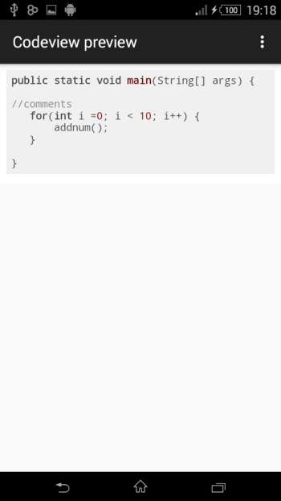
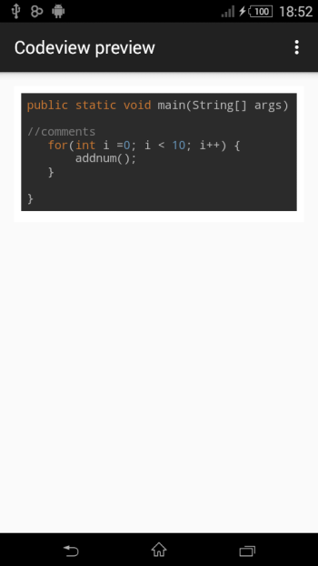
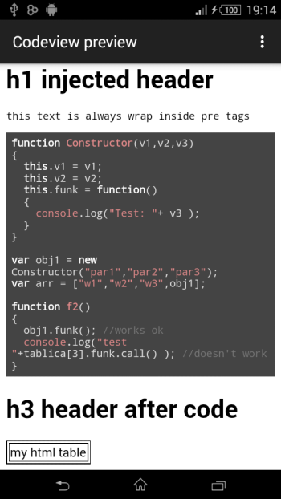

#Codeview
-------------

Codeview is a android library tha lets you
preview code in webview very easy and simple with highlighs and colors.
With styles to chooses and language.
Also you can inject html and text into webview or any extended webview class.

This library was inspired and is working thanks to [highlight.js](https://highlightjs.org/).
App using this library. https://play.google.com/store/apps/details?id=com.protectsoft.javatutorial


Usage
-----

#### Codeview


#####1) Get a reference to your WebView or any extended WebView

```java
WebView webview = (WebView) findViewById(R.id.webview);
//set settings here
```

#####2) Basic usage. Default style is Original, and default language is java.

```java
//your string code 
String code = "public static void main(String[] args) { \n" +
                "\n" +
                "//comments\n" +
                "   for(int i =0; i < 10; i++) {\n" +
                "       addnum();\n" +
                "   }\n" +
                "\n" +
                "}\n";
								
Codeview.with(getApplicationContext())
		.withCode(code)
		.into(webview);
```


#####3) set style and language.

```java
MyTouchWebView webview = (MyTouchWebView) findViewById(R.id.mytouchwebview);
//set settings here
```

```java
//your string java code 
String code = "public static void main(String[] args) { \n" +
                "\n" +
                "//comments\n" +
                "   for(int i =0; i < 10; i++) {\n" +
                "       addnum();\n" +
                "   }\n" +
                "\n" +
                "}\n";
								
Codeview.with(getApplicationContext())
		.withCode(code)
		.setStyle(Settings.WithStyle.DARKULA)
        .setLang(Settings.Lang.JAVA)
		.into(webview);
```


#####4) Inject html head content and text.

```java
WebView webview = (WebView) findViewById(R.id.webview);
//set settings here
```

```java
//your string javascript code
        String code = "function Constructor(v1,v2,v3)\n" +
                "{\n" +
                "  this.v1 = v1;\n" +
                "  this.v2 = v2;\n" +
                "  this.funk = function()\n" +
                "  {\n" +
                "    console.log(\"Test: \"+ v3 );\n" +
                "  }\n" +
                "}\n" +
                "\n" +
                "var obj1 = new Constructor(\"par1\",\"par2\",\"par3\");\n" +
                "var arr = [\"w1\",\"w2\",\"w3\",obj1];\n" +
                "\n" +
                "function f2()\n" +
                "{            \n" +
                "  obj1.funk(); //works ok\n" +
                "  console.log(\"test \"+tablica[3].funk.call() ); //doesn't work\n" +
                "}";
                
                
        Codeview.with(getApplicationContext())
                .setHtmlHeadContent("<style> table,tr,td {" +
                        " border: 1px solid black;" +
                        " }" +
                        "" +
                        "</style>")
                .withHtml("<h1> h1 injected header</h1>")
                .withText("this text is always wrap inside pre tags")
                .withCode(code)
                .withHtml("<h1> h1 header after code </h1>")
                .withHtml("<table><tr><td> my html table </td></tr></table>")
                .setStyle(Settings.WithStyle.DARKSTYLE)
                .setLang(Settings.Lang.JAVASCRIPT)
                .setAutoWrap(true)
                .into(webView);
```



####Download
--------

```groovy
repositories {
        jcenter()
    }
    
compile 'Codeview-1.0.0:webviewcode:1.0.0' 
```

License
-------

    Copyright 2016 Avraam Piperidis

   Licensed under the Apache License, Version 2.0 (the "License");
   you may not use this file except in compliance with the License.
   You may obtain a copy of the License at

     http://www.apache.org/licenses/LICENSE-2.0

   Unless required by applicable law or agreed to in writing, software
   distributed under the License is distributed on an "AS IS" BASIS,
   WITHOUT WARRANTIES OR CONDITIONS OF ANY KIND, either express or implied.
   See the License for the specific language governing permissions and
   limitations under the License.
